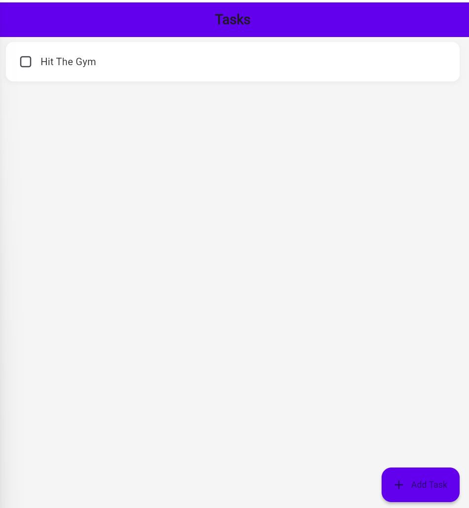
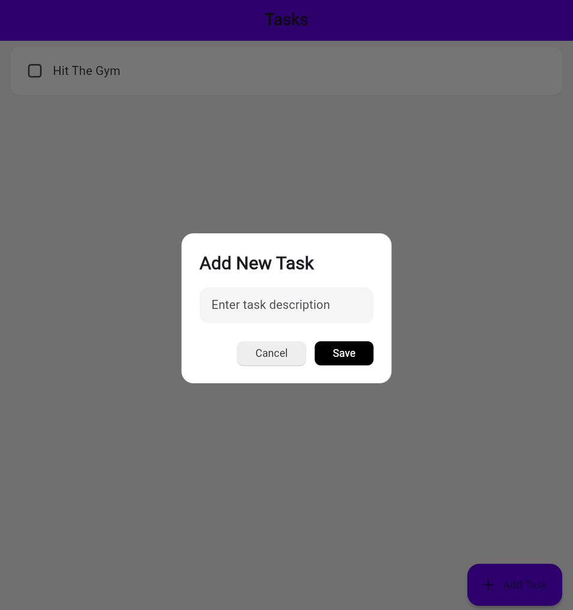
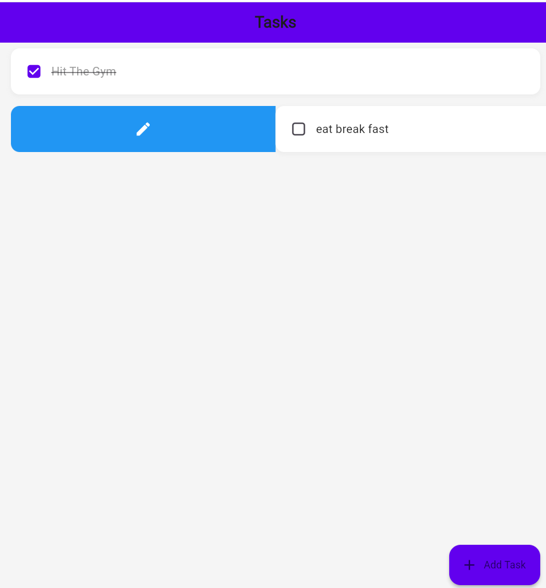

# To-Do List App 📋

A simple and intuitive Flutter application to manage your daily tasks efficiently.

---

## 🌟 Features

- Add, edit, and delete tasks seamlessly.
- Organize tasks with a clean and user-friendly interface.
- Data persistence powered by **Hive**, a lightweight and blazing-fast key-value database.
- Cross-platform compatibility: Works on both Android and iOS.

---

## 🛠️ Technologies Used

- **Frontend**: Built using the **Flutter Framework**, ensuring smooth and responsive UI.
- **Database**: Temporary storage using the **Hive Database**.

---

## 📸 App Preview

| Home Screen | Add Task Screen | Edit Task Screen | Delete Task Screen|
|-------------|-----------------|------------------|-------------------|
|  |
  | 
  |
  |


---

## 🚀 Getting Started

1. Clone the repository:
   ```bash
   git clone https://github.com/yourusername/todolistapp.git
