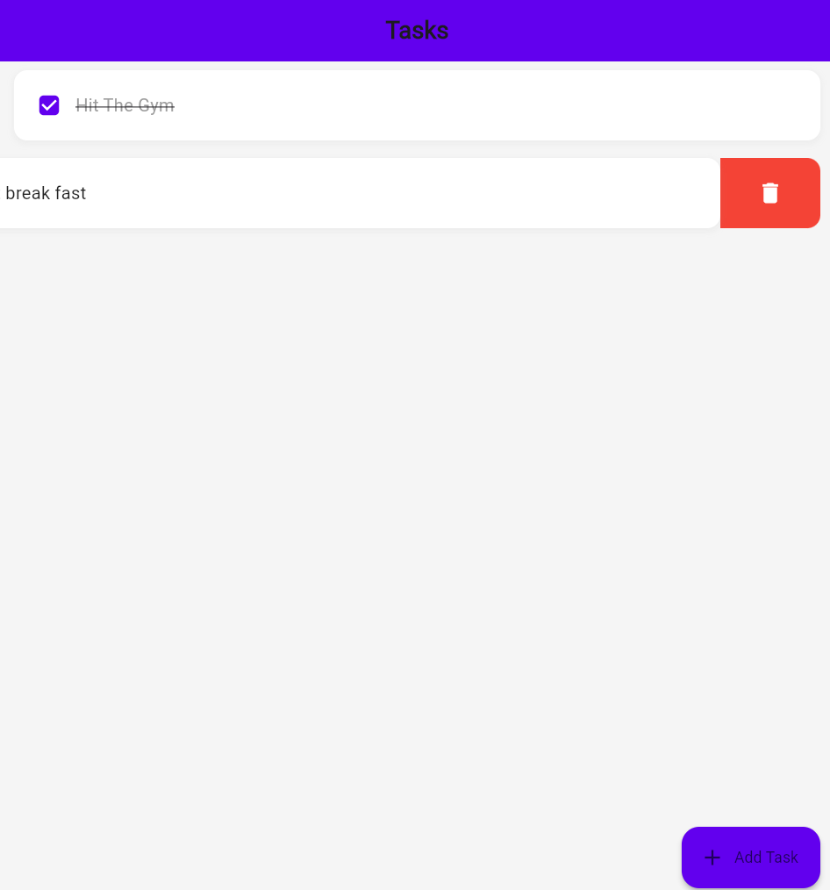

# ✨ TaskMaster - Your Ultimate Todo Companion

A beautifully crafted Flutter application that transforms your daily task management into a delightful experience. Built with modern design principles and powerful features, TaskMaster helps you stay organized effortlessly.

## 🎯 Key Features

TaskMaster brings you a thoughtfully designed experience with features that make task management a breeze:

- Create and manage tasks with an intuitive interface
- Edit existing tasks with a simple swipe gesture
- Delete completed tasks effortlessly
- Persistent storage using Hive database
- Beautiful animations and transitions
- Cross-platform compatibility

## 📱 Visual Journey Through TaskMaster

Experience our app's clean and intuitive interface through these carefully crafted screens:

<div align="center">
  <table>
    <tr>
      <td align="center"><strong>Home Screen</strong></td>
      <td align="center"><strong>Add Task Screen</strong></td>
      <td align="center"><strong>Edit Task Screen</strong></td>
      <td align="center"><strong>Delete Task Screen</strong></td>
    </tr>
    <tr>
      <td></td>
      <td></td>
      <td></td>
      <td></td>
    </tr>
    <tr>
      <td align="center">Your task command center</td>
      <td align="center">Quick task creation</td>
      <td align="center">Seamless task updates</td>
      <td align="center">Easy task removal</td>
    </tr>
  </table>
</div>

## 🛠️ Technical Foundation

Our app is built using modern technologies that ensure reliability and performance:

- **Frontend Framework**: Flutter
- **State Management**: Efficient state handling
- **Database**: Hive for reliable local storage
- **Architecture**: Clean and maintainable codebase

## 🚀 Getting Started

Follow these simple steps to get TaskMaster running on your device:

1. Clone the repository:
   ```bash
   git clone https://github.com/Raghavendra-Reddy-Padala/TASKMASTER.git
   ```

2. Navigate to project directory:
   ```bash
   cd taskmaster
   ```

3. Install dependencies:
   ```bash
   flutter pub get
   ```

4. Run the app:
   ```bash
   flutter run
   ```

## 💡 Usage Guide

TaskMaster is designed to be intuitive, but here's a quick guide to get you started:

1. **Adding Tasks**
   - Tap the + button
   - Enter your task details
   - Hit Save to create the task

2. **Editing Tasks**
   - Swipe left on any task
   - Modify the task details
   - Save your changes

3. **Deleting Tasks**
   - Swipe right on any task
   - Confirm deletion

## 🎨 Customization

TaskMaster can be customized to match your preferences. Modify the `lib/theme/app_theme.dart` file to change:
- Color schemes
- Text styles
- Animation durations
- Layout properties

## 🤝 Contributing

We welcome contributions! Here's how you can help:

1. Fork the repository
2. Create your feature branch (`git checkout -b feature/AmazingFeature`)
3. Commit your changes (`git commit -m 'Add some amazing feature'`)
4. Push to the branch (`git push origin feature/AmazingFeature`)
5. Open a Pull Request

## 📈 Future Roadmap

We're continuously improving TaskMaster. Coming soon:
- Task categories and tags
- Due date reminders
- Cloud synchronization
- Dark mode support
- Statistics dashboard

## 🙏 Acknowledgments

Special thanks to:
- Flutter team for the amazing framework
- Hive database for efficient data storage
- Our amazing contributors and users

---

<p align="center">Made with ❤️ by P Raghavendra Reddy</p>

```
Last Updated: January 2025
Version: 1.0.0
```